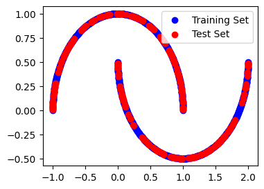
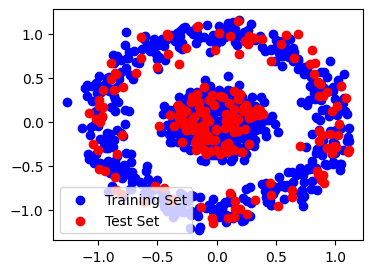
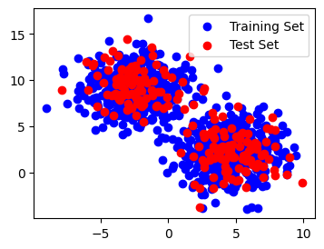
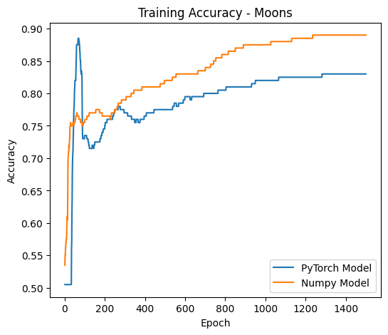
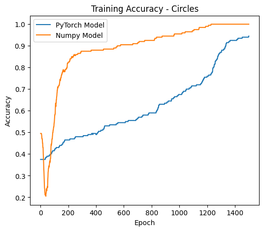
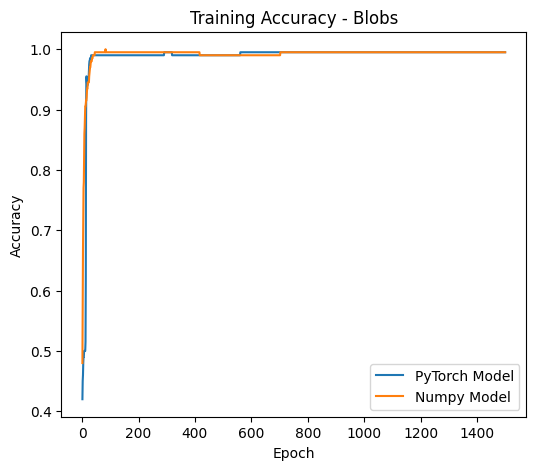
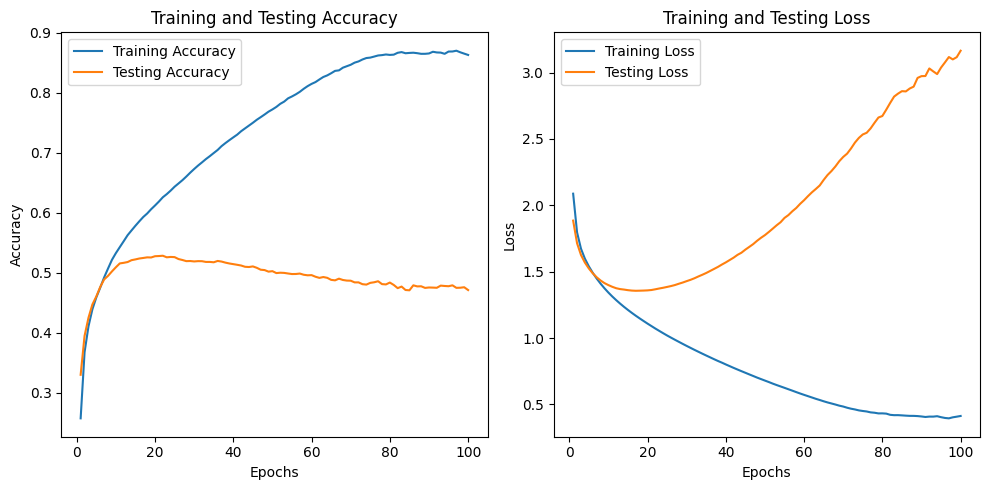

# CS 324: Assignment 2 Report

Name: Zhangjie Chen

SID: 12012524

## Introduction

The second assignment of *CS 324 Deep Learning* includes three major parts.

The part I is about getting started with PyTorch. PyTorch is a machine learning library based on the Torch library, used for applications such as computer vision and natural language processing. Through Part I, one can enhance their understanding in using PyTorch to build 

## Methodology & Result Analysis

### Part I PyTorch MLP

#### Task I&II

In this part, we are required to implement the MLP using PyTorch. PyTorch provides various modules and functions which allow us to easily define and train neural networks.

Compared to NumPy, PyTorch provides high-level abstractions in `torch.nn`, such as `torch.nn.Linear`, and activation functions like `torch.nn.ReLU`, and loss functions like `torch.nn.CrossEntropyLoss`, which simplify the process of defining the MLP architecture. As we need to manually implement the modules with NumPy, PyTorch allows us to define the architecture using concise code.

After completing the MLP architecture as in the files **pytorch_mlp.py** and **pytorch_train_mlp.py**, we can proceed to train and compare both the numpy and PyTorch implementations on the same datasets. 

In order to test the modes, three datasets are generated using modules in [Scikit-learn samples generator](https://scikit-learn.org/stable/modules/classes.html#samples-generator), including:

* 1000 points sampled from `make_moons` function

  

* 1000 points from `make_circles` function

* 1000 points from `make_blobs` function

After training with batch gradient descent, by evaluating on the three datasets, we can plot the result of Accuracy vs Epoch:

* Moons dataset

  

* Circles dataset

  

* Blobs dataset

  

Experiments on three datasets show similar accuracy rates with both implementations of the MLP architecture.

#### Task III

In Task III, instead of utilizing generated datasets, we devised a Multi-Layer Perceptron (MLP) model for classifying the CIFAR-10 dataset. The architecture of the MLP model is structured as follows:

- **Flatten Layer**: Reshapes the input data into a single vector.
- **Fully Connected Layer 1**: Input size of 3*32*32, Output size of 128.
- **ReLU Activation Layer**: Applies the Rectified Linear Unit (ReLU) activation function element-wise.
- **Fully Connected Layer 2**: Input size of 128, Output size of 64.
- **ReLU Activation Layer**: Applies the ReLU activation function element-wise.
- **Output Layer**: Input size of 64, Output size of 10 (number of classes in CIFAR-10).

The model is trained using Stochastic Gradient Descent (SGD) optimizer with the following hyper-parameters:

- Learning rate: 0.001
- Batch size: 64
- Number of epochs: 100

During the training process, both training accuracy and loss show a tendency to converge as the number of epochs increases. However, the test accuracy fails to reach an optimal value due to over-fitting.

Furthermore, it's notable that the fully connected layers in the MLP are densely connected, implying that every neuron in the output is connected to every input neuron. Conversely, in a convolutional layer, neurons are not densely connected but are linked only to neighboring neurons within the width of the convolutional kernel. Hence, for tasks involving images and a large number of neurons, a convolutional layer is typically more suitable due to its ability to capture spatial hierarchies in the data.

### Part II PyTorch CNN

## Reference

- [Learning Multiple Layers of Features from Tiny Images](https://www.cs.toronto.edu/~kriz/learning-features-2009-TR.pdf), Alex Krizhevsky, 2009.
