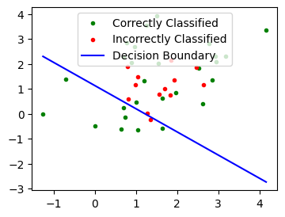
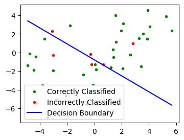

# CS 324 Assignment 1 Report

Name: Zhangjie Chen

SID: 12012524

## Introduction

The first assignment of *CS 324 Deep Learning* includes two major parts.

The part I is about the perceptron, which is a type of artificial neuron or the simplest form of a neural network, serving as the foundational building block for more complex neural networks. The assignment requires implementing a simple perception which is able to be trained and predict on given inputs. 

The part II and part III are about the multi-layer perceptron, which 

## Motivation

The motivation behind this assignment lies in the exploration of the basic principles of neural networks. By understanding the perceptron, we gain insight into how neural networks operate at a fundamental level. This knowledge serves as a stepping stone for solving more complex neural network tasks.


## Methodology & Result Analysis

### Part I Perceptron

In part I, a perceptron is implemented under the template code, and the experiment is conducted in `part_I.ipynb`.

##### Generating dataset

* By numpy *multivariate_normal*, the 2D points are generated with given means and covariances.

* To separate those points into training and testing datasets, the first 80 points of both arrays are pushed into a array for training dataset and the left points are pushed into another array for testing dataset.

For example, the generated dataset of Gaussian distribution with means of (-2, -2) and (2, 2) and covariances of 1 is shown as below:


##### Training the perceptron

The perceptron training process includes a set of steps following the **standard algorithm**:

* Initialize weights randomly or with zeros. 

* For each epoch in range(max_epochs):    

  * a. Shuffle the training inputs and corresponding labels. 

  * b. For each training input and its corresponding label:   

    * i. Perform forward pass to obtain predicted labels.

    * ii. If predicted label and true label have different signs (misclassified):      

      ​        Update weights using the perceptron learning rule:               

      ​        $w := w + lr \cdot \text{true label} \cdot \text{input vector}$

* Return trained weights.

In my experiment, the perceptron is first trained with the following parameters on the first dataset (Gaussian distribution with means of (-2, -2) and (2, 2) and covariances of 1):

| Parameter     | Value |
| ------------- | ----- |
| Epoch         | 10    |
| Learning Rate | 0.01  |
| Shuffle       | true  |

In each epoch, the perceptron passes the input through the forward process to get a prediction. If the signs of the prediction and the truth label are identical, in other words, predicted output matches the true label, there is no adjustment to the weights. If they don't, the perceptron updates its weights based on the perceptron learning rule, aiming to minimize the classification error. This process continues for a specified number of epochs so that the the training examples can be correctly classified.

The loss function converges immediately in the first few epochs:


And as shown in the above picture, all of the points have been correctly classified. The decision boundary is shown as a hyperplane defined by:
$$
w \cdot x + b = 0
$$
where $w$ is the weight and $b$​ is the bias (last term of the actual weight).

The accuracy is calculated by:
$$
acc = \frac{\text{number of correctly classified points}}{\text{number of points}}
$$
It is obvious that the perception achieved 100% accuracy on the first set of data.

##### Experiment with different sets of points

###### When the mean values of the two Gaussians are too close:

The generated dataset of Gaussian distribution with similar means of (2, 2) and (1, 1) and covariances of 1 is shown as below:


It is obvious that when the mean values of the two Gaussians are too close, some points get mixed up.

The loss function failed to converge within 10 epochs, so the epoch number is set to 100:




The accuracy only reached 0.675 as it is impossible to correctly classify these points with a hyperplane.


###### When the variance of the two Gaussians are too high:

The generated dataset of Gaussian distribution with means of (-2, -2) and (2, 2) and covariances of 5 is shown as below:


The loss converges with the increase of epoch, but it never reaches zero.




The accuracy is 0.85. Similarly, it is impossible to reach 100% because a hyperplane fails to classify the points in this case.


### Part II The Multi-Layer Perceptron

In part II, a multi-layer perceptron is implemented under the template code, and the experiment is conducted in `part_II.ipynb`.

##### Module Implementation

###### Class Linear:

The linear layer performs affine transformation with formula:  $\text{output} = x *\text{weight} + \text{bias}$.

* The weights are initialized with size = in_features * out_features, and value = random small values to disrupt symmetry.

* The forward process performs the transformation, generating an output.

* The backward process takes in `dout` as the gradients of the previous module. It then calculate gradients of loss and update gradients for weight and bias.

###### Class ReLU:

The rectified linear unit (ReLU) unit activation function introduces the property of nonlinearity to a deep learning model and solves the vanishing gradients issue. With ReLU layers, the flow of gradients backward during backpropagation becomes easier, and the training becomes more effective.

* The forward process performs $x = \max(x, 0)$, it it has a constant gradient of 1 for all the positive inputs.

* The backward process returns an array with the same numbers with `dout` where $x > 0$, otherwise $0$.

###### Class SoftMax:

The SoftMax Layer applies the SoftMax function to the input to obtain output probabilities.

* The forward process performs $\text{softmax}(x_i) = \exp(x_i) / \sum(\exp(x_j))$ for all $j$. It converts the output of the output layer into probabilities, representing how likely it is that each input belongs to each label.

* The backward process does nothing.

###### Class CrossEntropy:

The Cross Entropy works as a loss function.

* The forward process calculates the cross entropy loss, measures the performance of a classification model whose output is a probability value between 0 and 1.
* The backward process calculates the gradient between prediction and true label.

##### Dataset

The generated dataset of default parameters of 1000 points is shown below:


The labels are converted with one-hot encoding.

##### Model Structure

The model contains several hidden layers, each unit of which is composed of a linear layer and a ReLU layer, and the model also contains an output layer and a SoftMax layer.

In my implementation, the layers were sequentially appended to a **layer list**, enabling easy execution of the forward and backward pass by invoking the forward() and backward() methods in a loop.

##### Model Training

To train the MLP, I completed the train script `train_mlp_numpy.py`, and the train process can be concluded by the following process:

* Load dataset, randomly split into training set (800 samples) and test set (200 samples).
* Perform forward pass to get a prediction of current layers.
* Calculate loss with the CrossEntropy module.
* Calculate accuracy and store to output.
* Perform backward pass to calculate gradients of loss.
* Update models according to the gradients and learning rate.

The model is trained using the default values of the parameters:

| Parameter        | Value |
| ---------------- | ----- |
| num_hidden_units | [20]  |
| learning rate    | 0.01  |
| epoch            | 1500  |


```
Step: 1499, Loss: 0.23309685011049974, Accuracy: 0.89
```

With the increase of epoch number, the accuracy demonstrates a rapid initial rise and a slower rise afterwards. The loss goes down smoothly.

However, the final accuracy was only **0.85** and the loss was 0.26 which wasn't perfect. The deficiency results from the insufficient number of epochs, or the learning rate is not large enough, resulting in the MLP loss function stopping training before convergence.

By slightly increasing the learning rate to 0.3, the MLP achieved better result:


```
Step: 1499, Loss: 0.025139461572894466, Accuracy: 1.0
```

### Part III: Stochastic Gradient Descent

##### Stochastic Gradient Descent

Stochastic gradient descent (SGD), by contrast, calculates the error for each training example within the dataset, meaning it updates the parameters for each training example one by one. Depending on the problem, this can make SGD faster than batch gradient descent. One advantage is the frequent updates allow us to have a pretty detailed rate of improvement.

In order to implement SGD gradient descent, another parameter `batch_size` is added to the train method. In each epoch, `batch_size` number of train samples will be extracted from the train dataset. In this case, if we are using SGD, the `batch_size` will be 1.

The training process took significantly longer time to complete.

After training, we can see the loss function converges quickly:


And the MLP achieved a same accuracy.

```
Step: 1499, Loss: 0.20971993245122775, Accuracy: 0.89
```

##### Experiment with batch_size

###### When batch_size = 10


```
Step: 1499, Loss: 0.19799310239054674, Accuracy: 0.89
```

###### When batch_size = 100


```
Step: 1499, Loss: 0.22883605981843824, Accuracy: 0.895
```

The above figures and results conclude that with the increase of batch_size, the training process becomes more efficient, and the loss curve descend slower. However, the time cost doesn't come with higher accuracy. 

**Analysis**: 

In SGD, the model parameters are updated after computing the gradient on a single training example. This means that each parameter update is based on a noisy estimate of the true gradient. As a result, the updates can exhibit high variance, causing the training trajectory to be more erratic compared to batch gradient descent. Also, SGD tends to converge faster than batch gradient descent because it updates the parameters more frequently. 

While SGD can be more efficient in terms of convergence speed and generalization, it requires careful tuning of hyperparameters and may exhibit more variability in training dynamics compared to batch gradient descent.
