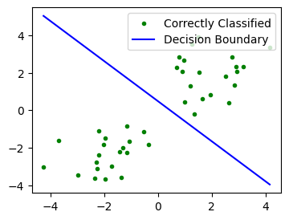

# CS 324 Assignment 1 Report

Name: Zhangjie Chen

SID: 12012524

## Introduction

The first assignment of *CS 324 Deep Learning* includes two major parts.

The part I is about the perceptron, which is a type of artificial neuron or the simplest form of a neural network, serving as the foundational building block for more complex neural networks. The assignment requires implementing a simple perception which is able to be trained and predict on given inputs. 

The part II and part III are about the multi-layer perceptron, which 

## Motivation

The motivation behind this assignment lies in the exploration of the basic principles of neural networks and their applications. By understanding the perceptron, we gain insight into how neural networks operate at a fundamental level. This knowledge serves as a stepping stone for tackling more complex neural network architectures and tasks.

## Methodology & Result Analysis

### Part I Perceptron

In part I, a perceptron is implemented under the template code, and the experiment is conducted in `part_I.ipynb`.

##### Generating dataset

* By numpy *multivariate_normal*, the 2D points are generated with given means and covariances.

* To separate those points into training and testing datasets, the first 80 points of both arrays are pushed into a array for training dataset and the left points are pushed into another array for testing dataset.

For example, the generated dataset of Gaussian distribution with means of (-2, -2) and (2, 2) and covariances of 1 is shown as below:

##### Training the perceptron

The perceptron training process includes a set of steps following the **standard algorithm**:

* Initialize weights randomly or with zeros. 

* For each epoch in range(max_epochs):    

  * a. Shuffle the training inputs and corresponding labels. 

  * b. For each training input and its corresponding label:   

    * i. Perform forward pass to obtain predicted labels.

    * ii. If predicted label and true label have different signs (misclassified):      

      ​        Update weights using the perceptron learning rule:               

      ​        $w := w + lr \cdot \text{true label} \cdot \text{input vector}$

* Return trained weights.

In my experiment, the perceptron is first trained with the following parameters on the first dataset (Gaussian distribution with means of (-2, -2) and (2, 2) and covariances of 1):

| Parameter     | Value |
| ------------- | ----- |
| Epoch         | 10    |
| Learning Rate | 0.01  |
| Shuffle       | true  |

In each epoch, the perceptron passes the input through the forward process to get a prediction. If the signs of the prediction and the truth label are identical, in other words, predicted output matches the true label, there is no adjustment to the weights. If they don't, the perceptron updates its weights based on the perceptron learning rule, aiming to minimize the classification error. This process continues for a specified number of epochs so that the the training examples can be correctly classified.

The loss function converges immediately in the first few epochs:

And as shown in the above picture, all of the points have been correctly classified. The decision boundary is shown as a hyperplane defined by:
$$
w \cdot x + b = 0
$$
where $w$ is the weight and $b$​ is the bias (last term of the actual weight).

The accuracy is calculated by:
$$
acc = \frac{\text{number of correctly classified points}}{\text{number of points}}
$$
It is obvious that the perception achieved 100% accuracy on the first set of data.

##### Experiment with different sets of points

###### When the mean values of the two Gaussians are too close:

The generated dataset of Gaussian distribution with similar means of (2, 2) and (1, 1) and covariances of 1 is shown as below:

It is obvious that when the mean values of the two Gaussians are too close, some points get mixed up.

The loss function failed to converge within 10 epochs, so the epoch number is set to 100:

The accuracy only reached 0.675 as it is impossible to correctly classify these points with a hyperplane.

###### When the variance of the two Gaussians are too high:

The generated dataset of Gaussian distribution with means of (-2, -2) and (2, 2) and covariances of 5 is shown as below:

The loss converges with the increase of epoch, but it never reaches zero.

The accuracy is 0.85. Similarly, it is impossible to reach 100% because a hyperplane fails to classify the points in this case.

### Part II The Multi-Layer Perceptron

In part II, a multi-layer perceptron is implemented under the template code, and the experiment is conducted in `part_II.ipynb`.

##### Module Implementation

###### Class Linear:

The linear layer performs affine transformation with formula:  $\text{output} = \text{weight} * x + \text{bias}$

* The weights are initialized to small random values drawn from a normal distribution.
* The bias term is initialized with 0s.
* The gradient is initialized with 0.

The forward process performs the formula.

The backward process takes in `dout` as the gradients of the previous module, and calculate gradients of loss.

###### Class ReLU:

The rectified linear unit (ReLU) unit activation function introduces the property of nonlinearity to a deep learning model and solves the vanishing gradients issue.

