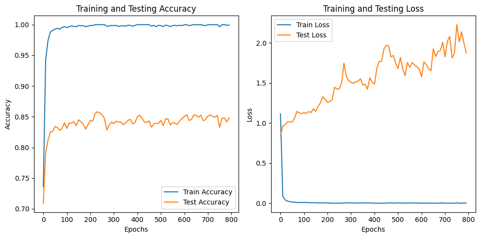
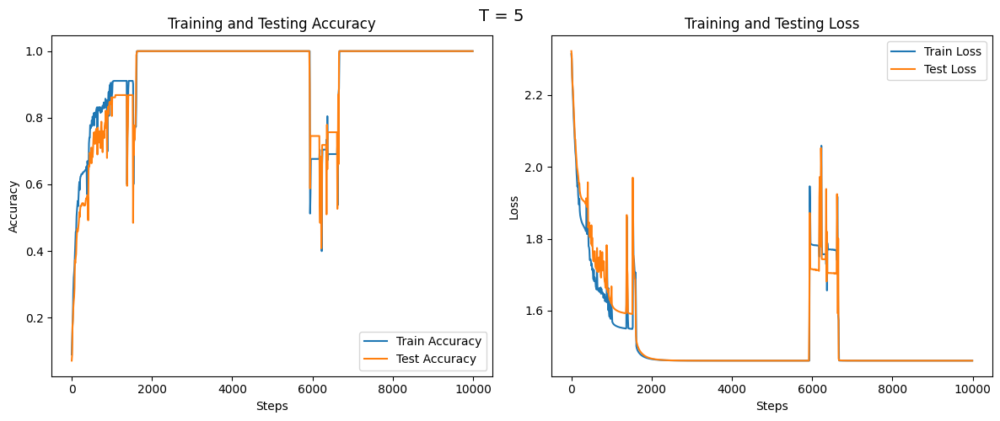
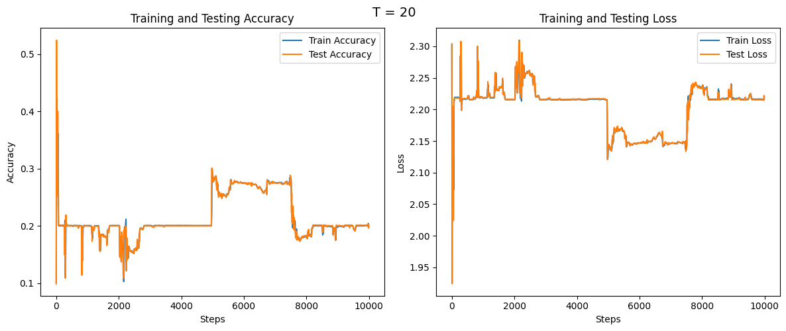

# CS 324: Assignment 2 Report

Name: Zhangjie Chen

SID: 12012524

## Introduction

The second assignment of *CS 324 Deep Learning* includes three major parts.

## Methodology & Result Analysis

### Part I PyTorch MLP

#### Task I&II

In this part, we are required to implement the MLP using PyTorch. PyTorch provides various modules and functions which allow us to easily define and train neural networks.

Compared to NumPy, PyTorch provides high-level abstractions in `torch.nn`, such as `torch.nn.Linear`, and activation functions like `torch.nn.ReLU`, and loss functions like `torch.nn.CrossEntropyLoss`, which simplify the process of defining the MLP architecture. As we need to manually implement the modules with NumPy, PyTorch allows us to define the architecture using concise code.

After completing the MLP architecture as in the files **pytorch_mlp.py** and **pytorch_train_mlp.py**, we can proceed to train and compare both the numpy and PyTorch implementations on the same datasets. 

In order to test the modes, three datasets are generated using modules in [Scikit-learn samples generator](https://scikit-learn.org/stable/modules/classes.html#samples-generator), including:

* 1000 points sampled from `make_moons` function

  

* 1000 points from `make_circles` function

* 1000 points from `make_blobs` function

After training with batch gradient descent, by evaluating on the three datasets, we can plot the result of Accuracy vs Epoch:

* Moons dataset

  

* Circles dataset

  

* Blobs dataset

  

Experiments on three datasets show similar accuracy rates with both implementations of the MLP architecture.

#### Task III

In Task III, instead of utilizing generated datasets, we devised a Multi-Layer Perceptron (MLP) model for classifying the CIFAR-10 dataset. The architecture of the MLP model is structured as follows:

- **Flatten Layer**: Reshapes the input data into a single vector.
- **Fully Connected Layer 1**: Input size of 3*32*32, Output size of 128.
- **ReLU Activation Layer**: Applies the Rectified Linear Unit (ReLU) activation function element-wise.
- **Fully Connected Layer 2**: Input size of 128, Output size of 64.
- **ReLU Activation Layer**: Applies the ReLU activation function element-wise.
- **Output Layer**: Input size of 64, Output size of 10 (number of classes in CIFAR-10).

The model is trained using Stochastic Gradient Descent (SGD) optimizer with the following hyper-parameters:

- Learning rate: 0.001
- Batch size: 64
- Number of epochs: 100

The training accuracy grows consistently, finally reaching nearly 90%, indicating the model is learning effectively from the training data. However, the testing accuracy plateaus around 50%, which suggests the model is not generalizing well to unseen data. This is a classic sign of over-fitting, where the model learns the training data too well, including noise and details irrelevant for generalization. This divergence between training and testing loss is another indicator that the model’s generalization is poor.

Furthermore, it's notable that the fully connected layers in the MLP are densely connected, implying that every neuron in the output is connected to every input neuron. Conversely, in a convolutional layer, neurons are not densely connected but are linked only to neighboring neurons within the width of the convolutional kernel. Hence, for tasks involving images and a large number of neurons, a convolutional layer is typically more suitable due to its ability to capture spatial hierarchies in the data.

### Part II PyTorch CNN

#### Task 1

According to the lecture slides, the reduced version of VGG network has an architecture of the following picture:

For each layer, it's easy to calculate the size of the features and the channels. (Size = (row, column, channel))

| Layer No. | Input Size | Output Size         |
| --------- | ---------- | ------------------- |
| 1         | 32x32x3    | 32x32x64            |
| 2         | 32x32x64   | 16x16x64            |
| 3         | 16x16x64   | 16x16x128           |
| 4         | 16x16x128  | 8x8x128             |
| 5         | 8x8x256    | 8x8x256             |
| 6         | 8x8x256    | 8x8x256             |
| 7         | 8x8x256    | 4x4x256             |
| 8         | 4x4x256    | 4x4x512             |
| 9         | 4x4x512    | 4x4x512             |
| 10        | 4x4x512    | 2x2x512             |
| 11        | 2x2x512    | 2x2x512             |
| 12        | 2x2x512    | 2x2x512             |
| 13        | 2x2x512    | 512x1x1 (flattened) |
| 14        | 512x1x1    | 10                  |

The implementation of the network can be found in **Part 2/cnn_model.py** and **Part 2/cnn_train.py**.

#### Task 2

In the training process, CUDA is introduced to accelerate the process with the help of GPU.

The model utilizes the Adam optimizer for training, which combines the features of momentum optimization and adaptive learning rates. Adam optimizes the model's parameters by maintaining two dynamic variables: the first moment estimate, which represents the mean of the gradients, and the second moment estimate, which indicates the variance of the gradients. By leveraging historical gradient information, Adam adjusts the learning rate for each parameter accordingly, facilitating efficient and effective model training.

The model employs Mini-Batch gradient descent for optimization, wherein the training dataset is divided into batches. After the forward propagation of each batch, the gradients are computed and the model parameters are updated. This approach enables the model to iteratively learn from different subsets of the training data, enhancing its ability to generalize to unseen examples.

In Task 2, my model is trained with the default parameters:

| Batch Size | Epoch Number | Learning Rate | Evaluate Frequency | Optimizer |
| ---------- | ------------ | ------------- | ------------------ | --------- |
| 32         | 5000         | 0.0001        | 500                | Adam      |

From the accuracy graph, we can observe that the training accuracy quickly reaches near-perfect levels within the first 1000 epochs, indicating that the model fits the training data very well. However, the testing accuracy does not show a similar improvement. This suggests that the model might be over-fitting the training data.

The loss graph shows that as the training loss drops significantly close to zero, yet the testing loss increases after a sharp decline. The model learns to predict the training data with high accuracy, but its predictions for the test data become less reliable over time.

In summary, while the model has learned the training set effectively, its ability to generalize to new data is limited, as evidenced by the stagnation of test accuracy and the increase in test loss. To address this, regularization techniques, more training data, or a more generalizable model architecture could be considered.

In order to obtain better result, the model is trained with following parameters:

| Batch Size | Epoch Number | Learning Rate | Evaluate Frequency | Optimizer |
| ---------- | ------------ | ------------- | ------------------ | --------- |
| 32         | 800          | 0.0001        | 10                 | Adam      |

The model quickly learns to fit the training data within the first few epochs.

##### Summary

CNNs outperform MLPs on image classification tasks, particularly on datasets with high-dimensional and complex images. Their ability to learn hierarchical features directly from raw pixels makes them well-suited for tasks like object recognition.

### Part III PyTorch RNN

#### Task 1

In Task 1, the RNN model is implemented according to the formulas:
$$
h^{(t)} = \tanh(W_{hx} x^{(t)} + W_{hh} h^{(t−1)} + b_h ) \\
o^{(t)} = (W_{ph} h^{(t)} + b_o ) \\
ỹ ^{(t)} = \text{softmax}(o^{(t)})
$$
From above, we know that:

* $x^{(t)}$ is the input at time step $t$
* $h^{(t)}$ is the hidden state at time step $t$​
* $W_{hx}$ is the weight matrix for inputs
* $W_{hh}$ is the weight matrix for the hidden state from the previous time step $t-1$​
* $W_{ph}$ is the weight matrix connecting the hidden state to the output
* $b_h$ and $b_o$​ are the bias terms for hidden state and output respectively
* $\tanh$ is the activation function, the function squashes the resulting values into a range between -1 and 1. This step introduces non-linearity to the process, allowing the network to learn more complex patterns.

The model utilizes the **hidden state** to capture and maintain the relationship between inputs at consecutive time steps.  This relationship is incorporated into the model's decision-making process for generating predictions at each time step, allowing the model to understand and utilize the sequential nature of the input data.  As a result, the model can effectively capture temporal dependencies and patterns within the input sequence.

The RNN is designed in `Part 3/vanilla_rnn.py` as following:

| Layer     | Initialization                  |
| --------- | ------------------------------- |
| $W_{hx}$  | Linear(input_dim, hidden_dim)   |
| $W_{hh}$  | Linear(hidden_dim, hidden_dim)  |
| $W_{ph}$  | Linear(hidden_dim, output_dim)  |
| $h^{(t)}$ | zeros(input_length, hidden_dim) |

The RNN is trained with the following parameters:

| Batch Size | Epoch Number | Learning Rate | Evaluate Frequency | Optimizer |
| ---------- | ------------ | ------------- | ------------------ | --------- |
| 128        | 1000         | 0.001         | 10 (steps)         | RMSProp   |

Through the use of RMSProp optimizer, each parameter gets its own learning rate, which can be advantageous for datasets with sparse features and in settings where some parameters should be updated more aggressively than others. RMSProp can converge faster than SGD, especially in the contexts of large-scale neural networks and non-stationary problems, making it suitable for training deep neural networks. It is also less sensitive to the initial learning rate and generally requires less tuning of the learning rate parameter.

#### Task 2

Given the RNN implemented in Task 1 and a palindrome of length $T$, the network is able to predict the T-th digit given the preceding $T − 1$ ones. The model is trained with two different values of $T$:

When $T=5$​, the data size is limited by 1000,

Despite the spike, the general trend of the training and testing accuracy is upward, implying that the model is learning effectively over time.

When $T=20$,

The model's performance on this more complex task is markedly worse, as evidenced by the low accuracy and high loss.

##### Summary

The RNN performed well on shorter sequences, and struggled significantly on longer sequences. During backpropagation, gradients are calculated using the chain rule and are propagated backward in time. If the gradient values are small, multiplying them repeatedly during backpropagation through many time steps can lead to vanishing gradients. This is particularly problematic for long sequences, as it becomes increasingly challenging for the network to learn correlations between events that are far apart in time.

The RNN's memory capacity is limited due to the way it processes inputs sequentially and combines them with the current state at each step.  When the sequence is long, the influence of the input from the earlier time steps gets diluted as it gets mixed with more recent inputs. This issue is more evident in the performance on the length 20 palindromes, where remembering the first few digits is crucial for predicting the last digit.

For tasks requiring the network to maintain information over long sequences, it is often beneficial to use LSTM or GRU architectures, which are designed to have a more robust memory and are better at capturing long-range dependencies.

## Reference

- [Learning Multiple Layers of Features from Tiny Images](https://www.cs.toronto.edu/~kriz/learning-features-2009-TR.pdf), Alex Krizhevsky, 2009.

* [**CNN Explainer: Learning Convolutional Neural Networks with Interactive Visualization**](https://arxiv.org/abs/2004.15004). Wang, Zijie J., Robert Turko, Omar Shaikh, Haekyu Park, Nilaksh Das, Fred Hohman, Minsuk Kahng, and Duen Horng Chau. *IEEE Transactions on Visualization and Computer Graphics (TVCG), 2020.*
* https://damien0x0023.github.io/rnnExplainer/
* https://geeksforgeeks.org/adam-optimizer/
