# CS 324: Assignment 3 Report

Name: Zhangjie Chen

SID: 12012524

## Introduction

The third assignment of *CS 324 Deep Learning* includes two major parts.

In the first part of this assignment, we will replace the RNN model from the previous assignment with an LSTM model to solve a palindrome sequence prediction task. 

In the second part, we will implement a Generative Adversarial Network (GAN) to generate images similar to those in the training set.

## Methodology & Result Analysis

### Part I PyTorch LSTM

#### Task I

The recurrent neural network (RNN) from the last assignment failed to accurately predict the last digit of a long palindrome. In this part of the assignment, we turn to an advanced version of the RNN architecture: Long Short-Term Memory (LSTM). LSTMs are designed to model chronological sequences and their long-range dependencies more effectively than conventional RNNs.

In my implementation, I followed the structure described in the assignment document. The structure contains gates and calculates cell state $c^{t}$ at time step $t$​. The model can be found in `Part 1/lstm.py`

#### Task II

The model is trained with dataset of palindrome of length 5 and 20:

T = 5:

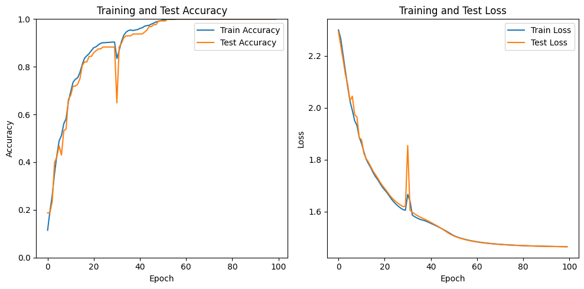

T=20:

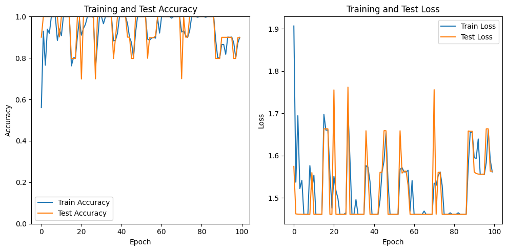

The LSTM model performs well on palindromes with different lengths. This is because LSTM networks are specifically designed to handle sequences with long-range dependencies, which is crucial for recognizing palindromic structures. LSTM uses gates (input, forget, and output gates) to control the flow of information and maintain a more constant gradient during backpropagation, preventing the vanishing gradient problem. This allows LSTM models to effectively remember and utilize information from earlier in the sequence, enabling them to identify patterns and dependencies necessary for correctly processing and predicting palindromes regardless of their length. Moreover, the cell state in LSTM provides a persistent memory that can store information over many time steps, which is essential for capturing the symmetry in palindromes.

### Part II Generative Adversarial Networks

**GAN**(Generative Adversarial Network) represents a cutting-edge approach to generative modeling within deep learning, often leveraging architectures like convolutional neural networks. The goal of generative modeling is to autonomously identify patterns in input data, enabling the model to produce new examples that feasibly resemble the original dataset.

#### Task I

In my implementation, the generator and discriminator are designed following the template. Both networks are trained together. 

For each batch, we generate a random noise input for the generator, and test the discriminator with both real images and generated images. After we obtain the loss, we update both models.

Finally, the model is saved in `Part 2/mnist_generator.pth`.

#### Task II

During the training process, the generated images are saves for every 500 batches (64 images per batch).

In the first 1000 batches, the generator performed poorly (figure shows results of 0, 500, 1000 batches):

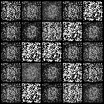 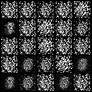

In the halfway of training, the generated images appears like a mix of noise and number (figure shows results of 59500, 60000, 60500 batches):

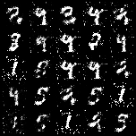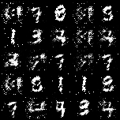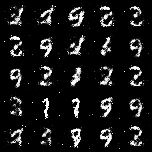

When the training process is over, the model generates images that were almost identical to handwritten numbers (figure shows results of 0, 500, 1000 batches):

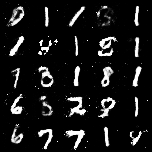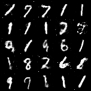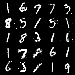

#### Task III

First, we creates two random noise vectors, representing the start and end points for interpolation in the latent space. We then generates a series of interpolated noise vectors between the two noise vectors using linear interpolation.

Then, we load the trained generator. Using the generator model, it creates images corresponding to each interpolated noise vector.

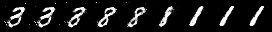

The generated grid image is a smooth transition of digit images, showing a sequence of digits gradually morphing from one into another. Specifically, in this case, the interpolation starts with a digit "3", smoothly transitions to a digit "8", and then finally to a digit "1". This visual representation demonstrates the generator's ability to create coherent digit images from interpolated noise vectors, effectively capturing the gradual transformation in the latent space.

## Reference

* https://www.geeksforgeeks.org/understanding-of-lstm-networks/
* https://www.geeksforgeeks.org/generative-adversarial-network-gan/
